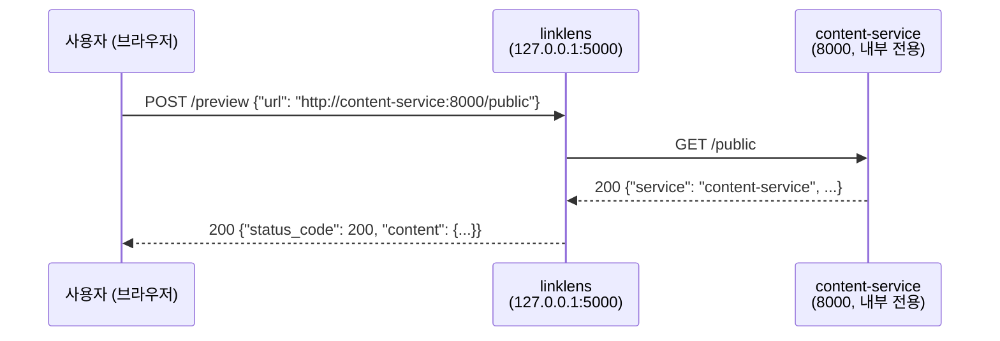
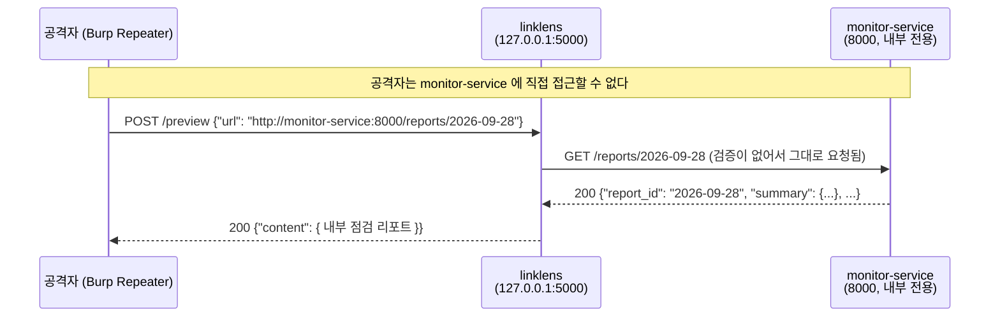
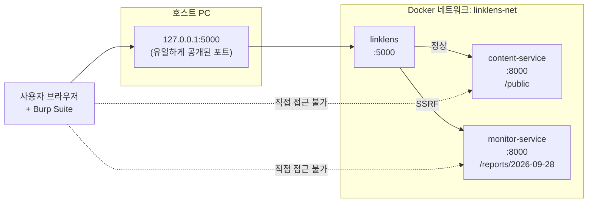

# SSRF Security Lab — LinkLens

> ## ⚠️ 경고 — 반드시 읽어 주세요
>
> - 이 저장소는 **의도적으로 취약하게 만든 교육용 애플리케이션**입니다.
> - **로컬 Docker 격리 환경에서만** 실행하세요.
> - **인터넷이나 공용 네트워크(학교 공유기, 사내망, 클라우드 서버 등)에 절대 노출하지 마세요.**
> - **본인이 소유하거나 명시적으로 허가받은 환경**에서만 사용하세요.
> - 이 저장소의 모든 실습은 Docker 내부 네트워크 안에서만 이루어집니다. 실제 인터넷 사이트를 공격하거나 호출하지 않습니다.
> - `monitor-service` 가 돌려주는 점검 리포트(`/reports/...`)는 **실제 비밀이 아니라** 공격 성공 여부를 눈으로 확인하기 위한 **실습용 가상 운영 데이터**입니다. 실제 비밀번호·API 키·개인정보는 이 저장소 어디에도 없습니다.

---

## 목차

1. [프로젝트 설명](#1-프로젝트-설명)
2. [요청 흐름](#2-요청-흐름)
3. [사전 준비](#3-사전-준비)
4. [설치 및 실행](#4-설치-및-실행)
5. [실습 화면(프론트엔드) 사용법](#5-실습-화면프론트엔드-사용법)
6. [2시간 실습 순서](#6-2시간-실습-순서)
7. [Burp Suite 실습](#7-burp-suite-실습)
8. [코드 분석 (Source & Sink)](#8-코드-분석-source--sink)
9. [단순 문자열 차단의 한계](#9-단순-문자열-차단의-한계)
10. [수정 방법](#10-수정-방법)
11. [수정 후 검증표](#11-수정-후-검증표)
12. [트러블슈팅](#12-트러블슈팅)
13. [결과물 안내](#13-결과물-안내)
14. [프로젝트 구조](#14-프로젝트-구조)

---

## 1. 프로젝트 설명

이 실습의 무대는 **LinkLens** 라는 작은 웹 서비스입니다.
자주 쓰는 링크를 저장해 두고, 열기 전에 **서버가 대신 그 주소를 가져와 미리보기**해 주는 평범한 앱처럼 보입니다.
바로 이 "서버가 대신 URL을 가져오는" 기능에 SSRF 취약점이 숨어 있습니다.

### SSRF 란?

**SSRF(Server-Side Request Forgery, 서버 측 요청 위조)** 는
**공격자가 서버를 시켜서, 공격자가 원하는 곳으로 요청을 보내게 만드는 취약점**입니다.

웹 서비스에는 "URL을 입력하면 서버가 대신 그 주소를 가져와서 보여주는" 기능이 흔히 있습니다.
(링크 미리보기, 썸네일 생성, 이미지 가져오기, 웹훅 등)
이때 서버가 **사용자가 준 URL을 검증 없이 그대로 요청**하면 SSRF가 됩니다.

### 정상 요청과 SSRF 공격 요청의 차이

| | 정상 요청 | SSRF 공격 요청 |
| --- | --- | --- |
| 사용자가 넣는 URL | `http://content-service:8000/public` | `http://monitor-service:8000/reports/2026-09-28` |
| 서버가 요청하는 곳 | 공개 콘텐츠 서비스 | **내부 전용 모니터링 서비스** |
| 결과 | 공개 정보 | 외부에 노출되면 안 되는 내부 점검 데이터 |

요청을 보내는 코드는 **완전히 똑같습니다.** 달라지는 것은 목적지뿐입니다.
그래서 "어디로 요청할지"를 사용자가 정할 수 있다는 사실 자체가 취약점입니다.

### 공격자가 내부 서비스에 직접 접근하지 못해도 공격이 가능한 이유

이 실습에서 `monitor-service` 는 호스트에 포트를 공개하지 않습니다.
브라우저 주소창에 `http://monitor-service:8000/reports/2026-09-28` 을 입력해도 열리지 않습니다.

하지만 LinkLens 웹앱은 **같은 Docker 네트워크 안에 있어서 내부 서비스에 접근할 수 있습니다.**
공격자는 직접 갈 수 없는 곳에, **접근 권한이 있는 서버를 대신 보내는** 것입니다.

```text
공격자 --(직접 접근 불가)--X--> monitor-service
공격자 --> LinkLens 웹앱 --(접근 가능)--> monitor-service
```

이것이 SSRF가 위험한 이유입니다. 방화벽 안쪽, 사설망, 관리자 전용 서비스가
"인터넷에서 직접 접근할 수 없으니 안전하다"는 가정이 무너집니다.

### 등장하는 세 서비스

| 서비스 (compose 이름) | 빌드 폴더 | 역할 | 내부 주소 |
| --- | --- | --- | --- |
| `linklens` | `vulnerable-app/` | 실습 대상인 URL 미리보기 웹앱. 호스트에 `127.0.0.1:5000` 으로만 공개 | `http://linklens:5000` |
| `content-service` | `safe-service/` | 미리보기가 가져오는 **공개 콘텐츠** 서비스 (정상 목적지) | `http://content-service:8000/public` |
| `monitor-service` | `internal-service/` | 저장된 링크 상태를 점검하는 **내부 전용** 서비스 (SSRF 목표) | `http://monitor-service:8000/reports/2026-09-28` |

> 📌 **폴더 이름과 compose 서비스 이름이 다릅니다.**
> 코드를 열 때는 폴더 이름(`vulnerable-app/`, `safe-service/`, `internal-service/`)을 쓰고,
> `docker compose logs` 등 컨테이너를 다룰 때는 서비스 이름(`linklens`, `content-service`, `monitor-service`)을 씁니다.
> 두 내부 서비스는 **각자 자기 컨테이너의 8000번 포트**를 씁니다(컨테이너마다 독립).

### ⚠️ SSRF ≠ CSRF

이름이 비슷해서 자주 헷갈리지만 **완전히 다른 취약점**입니다.

| | SSRF | CSRF |
| --- | --- | --- |
| 누가 요청을 보내나 | **서버** | **피해자의 브라우저** |
| 위조되는 것 | 서버의 아웃바운드 요청 | 로그인한 사용자의 요청 |
| 노리는 것 | 내부 시스템 접근·정보 유출 | 피해자 권한으로 상태 변경 |

이 실습에서는 **SSRF만** 다룹니다.

---

## 2. 요청 흐름

### 정상 흐름



```text
사용자 → linklens → content-service
```

### 공격 흐름 (SSRF)



```text
사용자 → linklens → monitor-service
```

### 전체 구성도



---

## 3. 사전 준비

실습 전에 아래를 미리 설치해 주세요. (Mac / Windows / Linux 공통)

| 도구 | 설명 | 확인 명령 |
| --- | --- | --- |
| **Git** | 저장소를 내려받기 위해 필요합니다. | `git --version` |
| **Docker Desktop** (Mac/Windows) 또는 **Docker Engine** (Linux) | 컨테이너 실행 | `docker --version` |
| **Docker Compose** | 여러 컨테이너를 한 번에 실행 | `docker compose version` |
| **Burp Suite Community Edition** | 요청을 가로채고 변조 | 실행되면 OK |
| **웹 브라우저** | Chrome, Firefox, Edge 등 | - |

> Docker Desktop을 설치하면 Docker Compose가 함께 설치됩니다.
> Linux에서는 `docker-compose-plugin` 패키지가 필요할 수 있습니다.
>
> Burp Suite Community Edition은 https://portswigger.net/burp/communitydownload 에서 무료로 받을 수 있습니다.

---

## 4. 설치 및 실행

### 내려받기

```bash
git clone <REPOSITORY_URL>
cd ssrf-security-lab
```

> 📌 `<REPOSITORY_URL>` 은 **여러분이 직접 바꿔야 하는 자리표시자**입니다.
> GitHub에 업로드한 뒤 실제 주소(예: `https://github.com/사용자명/ssrf-security-lab.git`)로 바꿔서 사용하세요.

### 실행

```bash
docker compose up --build
```

처음 실행할 때는 이미지를 받고 빌드하느라 몇 분 걸릴 수 있습니다.
세 서비스가 모두 `healthy` 상태가 되고, 아래와 비슷한 로그가 나오면 정상입니다.

```text
linklens-content  |  * Running on http://127.0.0.1:8000
linklens-monitor  |  * Running on http://127.0.0.1:8000
linklens-web      |  * Running on http://127.0.0.1:5000
```

> 두 내부 서비스의 `8000` 은 **각 컨테이너 안에서의 포트**입니다. 호스트에는 공개되지 않습니다.
> 호스트에서 열 수 있는 것은 `linklens` 웹앱의 `127.0.0.1:5000` 하나뿐입니다.

### 접속

브라우저에서 아래 주소를 엽니다.

```text
http://127.0.0.1:5000
```

화면 사용법은 [5번 실습 화면(프론트엔드) 사용법](#5-실습-화면프론트엔드-사용법)을 참고하세요.

### 종료

```bash
docker compose down
```

### 로그 확인

`docker compose logs` 는 **compose 서비스 이름**을 씁니다(폴더 이름이 아닙니다).

```bash
docker compose logs linklens          # 웹앱이 어떤 URL을 요청했는지
docker compose logs monitor-service   # 내부 서비스에 요청이 실제로 도달했는지
docker compose logs content-service   # 정상 요청이 도달했는지
```

실시간으로 보려면 `-f` 를 붙입니다.

```bash
docker compose logs -f monitor-service
```

### 코드 수정 후 재빌드

```bash
docker compose up --build
```

---

## 5. 실습 화면(프론트엔드) 사용법

컨테이너를 실행한 뒤 브라우저에서 접속합니다.

```text
http://127.0.0.1:5000
```

화면에 보이는 것은 **LinkLens** 라는 평범한 링크 관리 서비스입니다.
겉보기에는 보안 실습용이라는 티가 전혀 나지 않습니다.

> 📌 **이 화면은 정답을 알려 주지 않습니다.**
> 공격 주소, 취약점 설명, 공격 성공 판정 같은 실습용 힌트는 화면에 전혀 없습니다.
> 취약점은 참가자가 **Burp Suite로 요청을 직접 분석해서** 찾아야 합니다.
> 실습에 필요한 모든 설명은 이 README에 있습니다.

### 5.1 화면 구성

화면에는 URL과 관련된 기능이 **세 가지** 있습니다. 각 기능은 서로 다른 로컬 API 하나만 호출합니다.

| 기능 | 보내는 요청 | 서버가 하는 일 |
| --- | --- | --- |
| **① 링크 미리보기** | `POST /preview` (`{"url": ...}`) | **서버가 그 URL로 직접 요청**해서 내용을 가져옵니다 ← 취약점은 여기 |
| **② 저장된 링크** | `GET /api/links`, `GET /api/links/<id>` | 저장 당시의 스냅샷만 돌려줍니다 (외부 요청 없음) |
| **③ URL 형식 확인** | `POST /api/url-check` | URL을 구성요소로 **분해만** 합니다. 요청은 보내지 않습니다 |

정상 요청이든 공격 요청이든 **①의 결과 카드 모양은 똑같습니다.**
"공격 성공", "차단됨" 같은 판정은 화면에 표시되지 않으므로,
성공 여부는 **응답 본문과 `docker compose logs` 로 직접 판단해야 합니다.**

> 화면 상단의 **저장된 링크**(②) 목록에는 처음부터 몇 개의 링크가 들어 있습니다.
> 하나를 눌러 상세를 보면 URL이 `http://content-service:8000/...` 형태라는 것을 알 수 있습니다.
> 여기서 **서버가 어떤 내부 호스트로 요청하는지**에 대한 첫 단서를 얻을 수 있습니다.

### 5.2 정상 동작 확인 (기능 ①)

1. **링크 미리보기** 입력창에 아래 주소를 입력합니다.

   ```text
   http://content-service:8000/public
   ```

2. **`미리보기`** 를 누릅니다.
3. 결과 카드에 제목 `Public notice` 와 함께 본문에
   `This is an allowed public resource.` 가 보이면 정상입니다.

여기까지가 "평범한 사용자가 서비스를 써 보는" 단계입니다.
여기서 **무슨 일이 일어났는지**(누가 누구에게 요청했는지) 생각해 보는 것이 이번 실습의 출발점입니다.

### 5.3 내부 서비스를 찾아 요청해 보기 (SSRF)

취약점의 핵심은 **요청을 보내는 주체가 브라우저가 아니라 서버**라는 점입니다.
그래서 브라우저에서는 열 수 없는 주소도 서버는 열 수 있습니다.

내부 서비스의 존재는 화면 곳곳에 단서가 흩어져 있습니다.

- **저장된 링크**(②)의 URL → 서버가 요청하는 내부 호스트가 `content-service` 임을 알 수 있습니다.
- `content-service` 의 공지(`http://content-service:8000/notice`)를 미리보기로 열면
  본문에 **`monitor-service`** 라는 다른 내부 서비스와 **`/status`** 경로가 언급됩니다.
- 그 단서를 따라 `http://monitor-service:8000/status` 를 미리보기로 열면,
  응답이 상세 리포트 조회 경로 **`/reports/{id}`** 와 `latest_id` 를 알려 줍니다.

이렇게 알아낸 내부 주소를 미리보기 입력창(또는 Burp Repeater)에 넣습니다.

```text
http://monitor-service:8000/reports/2026-09-28
```

이 주소는 호스트에 포트가 공개되어 있지 않으므로 브라우저 주소창에 직접 입력하면 열리지 않습니다.
그러나 LinkLens 미리보기에 넣으면 **서버가 대신 요청**하고,
응답 본문에 **일반 사용자가 봐서는 안 되는 내부 점검 리포트**가 그대로 돌아옵니다.

```json
{
  "report_id": "2026-09-28",
  "summary": { "checked": 128, "reachable": 124, "failed": 4 },
  "recent_failures": [ ... ],
  "worker_nodes": ["monitor-a", "monitor-b"],
  "note": "내부 진단용 데이터"
}
```

> `/reports/latest` 도 같은 리포트를 돌려줍니다.

요청이 실제로 내부 서비스까지 도달했는지는 로그로 확인합니다.

```bash
docker compose logs monitor-service
```

다음과 비슷한 줄이 보이면 공격이 성공한 것입니다.

```text
... [monitor-service] GET /reports/2026-09-28 from=172.x.x.x -> 200
```

> 화면은 이 결과를 따로 해석해 주지 않습니다. 리포트는 그냥 응답 본문의 일부로만 표시됩니다.
> 그 데이터가 왜 중요한지(외부에 노출되면 안 되는 내부 정보라는 점)를 판단하는 것이 참가자의 몫입니다.

### 5.4 기능 ③(URL 형식 확인)의 쓸모

**URL 형식 확인**(③)은 서버가 요청을 보내지 않고 `urlparse()` 로 URL을 분해만 해서
스킴/호스트/포트/경로를 보여 줍니다. 이 실습에서는 **눈속임 URL의 진짜 목적지를 확인하는 도구**로 유용합니다.

예를 들어 아래를 ③에 넣어 보세요.

```text
http://content-service@monitor-service:8000/reports/2026-09-28
```

문자열에는 `content-service` 가 들어 있지만, **호스트** 칸에는 `monitor-service` 가 표시됩니다.
`content-service` 는 사용자정보(`user@`)일 뿐이고 실제 목적지는 `monitor-service` 라는 뜻입니다.
[9번 단순 문자열 차단의 한계](#9-단순-문자열-차단의-한계)에서 이 눈속임을 다시 다룹니다.

### 5.5 Burp Suite에서 `/preview` 요청 찾기

LinkLens는 평범한 웹 요청을 보냅니다. Burp로 그 요청을 잡아서 직접 조작하세요.

1. Burp의 **Proxy → Open browser** 로 내장 브라우저를 열고 `http://127.0.0.1:5000` 에 접속합니다.
2. `http://content-service:8000/public` 로 `미리보기` 를 한 번 누릅니다.
3. Burp **Proxy → HTTP history** 에서 아래 조건으로 요청을 찾습니다.
   - Method: `POST`
   - Path: `/preview`
   - Content-Type: `application/json`
   - Body: `{"url": "..."}`
4. 그 요청을 우클릭 → **Send to Repeater** 로 보냅니다.
5. Repeater에서 본문의 `url` 값만 바꿔 가며 실습합니다. (자세한 절차는 [7번 Burp Suite 실습](#7-burp-suite-실습))

요청 형태는 다음과 같습니다.

```http
POST /preview HTTP/1.1
Host: 127.0.0.1:5000
Content-Type: application/json
Content-Length: 46

{"url": "http://content-service:8000/public"}
```

### 5.6 이 화면은 왜 내부 주소를 막지 않나요?

이 프론트엔드는 **입력이 비어 있는지만** 확인하고, 호스트·스킴·포트는 전혀 검사하지 않습니다.
일부러 그렇게 만들었습니다.

**클라이언트(브라우저) 검증은 SSRF 방어가 될 수 없습니다.**

- 브라우저에서 도는 JavaScript는 **공격자가 마음대로 고치거나 건너뛸 수 있습니다.**
- 공격자는 화면을 아예 쓰지 않고 Burp Repeater나 `curl` 로 서버에 직접 요청을 보냅니다.

  ```bash
  curl -X POST http://127.0.0.1:5000/preview \
    -H 'Content-Type: application/json' \
    -d '{"url": "http://monitor-service:8000/reports/2026-09-28"}'
  ```

- 즉 화면에서 입력을 막아도 **서버는 여전히 요청을 받습니다.**

그래서 검증은 반드시 **서버(`vulnerable-app/app.py`)** 에서 해야 하고,
이번 실습의 수정 대상도 프론트엔드가 아니라 백엔드입니다.
(프론트엔드의 빈 값 확인은 사용자 편의를 위한 것이지 보안 기능이 아닙니다.)

### 5.7 수정 전후 재검증 방법 (프론트엔드 사용)

백엔드를 수정하고 `docker compose up --build` 로 재빌드한 뒤, 같은 화면에서 이렇게 확인합니다.

| 순서 | 입력 URL | 기대 결과 |
| --- | --- | --- |
| 1 | `http://content-service:8000/public` | 결과 카드에 `Status Code 200` (회귀 테스트: 정상 기능 유지) |
| 2 | `http://monitor-service:8000/reports/2026-09-28` | 결과 카드 없이 오류 메시지 (서버가 `HTTP 400` 으로 거부) |
| 3 | `file:///etc/passwd` | 오류 메시지 (스킴 거부) |
| 4 | `http://content-service:8001/public` | 오류 메시지 (포트 거부) |
| 5 | `docker compose logs monitor-service` | `/reports/...` 기록이 **더 이상 늘어나지 않음** |

화면만 보면 "차단"과 "네트워크 오류"가 같은 메시지로 보입니다.
정확한 상태 코드와 거부 사유는 **Burp Repeater의 응답**과 **`docker compose logs linklens`** 로 확인하세요.
응답만 막고 요청은 실제로 나가는 경우(가짜 차단)를 구분하려면 `monitor-service` 로그 확인이 필수입니다.

> 브라우저에 이전 화면이 남아 있으면 **강력 새로고침**(Mac `Cmd + Shift + R`, Windows `Ctrl + F5`)으로
> 수정된 정적 파일을 다시 받아오세요.

---

## 6. 2시간 실습 순서

| 시간 | 내용 | 목표 |
| --- | --- | --- |
| **0 ~ 15분** | SSRF 요청 흐름 확인 | 구성도를 보며 "누가 누구에게 요청하는지" 이해하기 |
| **15 ~ 35분** | 정상 URL 요청 | 브라우저에서 `http://content-service:8000/public` 미리보기 성공 |
| **35 ~ 55분** | 내부 서비스 탐색 + Burp Repeater로 접근 | 단서를 따라 `monitor-service` 를 찾아 `/reports/2026-09-28` 조회 + 로그 확인 |
| **55 ~ 75분** | 취약 코드의 Source / Sink 분석 | 어디서 입력이 들어와 어디서 위험해지는지 찾기 |
| **75 ~ 95분** | 단순 문자열 차단 적용 및 한계 확인 | 차단 목록이 왜 실패하는지 직접 경험하기 |
| **95 ~ 110분** | 허용 목록 기반 코드 수정 | `validate_url()` 구현 |
| **110 ~ 120분** | 공격 재시도 + 정상 기능 회귀 테스트 | 공격은 차단되고 정상 기능은 유지되는지 확인 |

---

## 7. Burp Suite 실습

### 0) Burp 프록시 준비

1. Burp Suite Community Edition 실행 → **Temporary project** → **Start Burp**
2. 상단 **Proxy** 탭 → **Intercept** 탭에서 `Intercept is off` 인지 확인 (처음에는 꺼 두는 편이 편합니다)
3. **Proxy → Open browser** 버튼을 눌러 Burp 내장 브라우저를 엽니다.
   → 이 방법이 가장 쉽습니다. 인증서 설치나 프록시 설정이 필요 없습니다.

> 평소 쓰는 브라우저를 사용하고 싶다면 프록시를 `127.0.0.1:8080` 으로 설정하고
> `http://burp` 에서 CA 인증서를 설치해야 합니다. 실습에서는 내장 브라우저를 권장합니다.

### 1) 브라우저 요청을 Burp Proxy로 확인

1. Burp 내장 브라우저에서 `http://127.0.0.1:5000` 접속
2. **링크 미리보기** 입력창에 `http://content-service:8000/public` 을 넣고 **미리보기** 클릭
3. 화면에 상태 코드 `200` 과 응답 본문이 보이면 정상입니다.
4. Burp의 **Proxy → HTTP history** 에서 `POST /preview` 요청을 찾습니다.

### 2) `/preview` 요청을 Repeater로 보내기

1. HTTP history 에서 `POST /preview` 항목을 **오른쪽 클릭**
2. **Send to Repeater** 선택
3. 상단 **Repeater** 탭으로 이동

### 3) 정상 URL 요청

Repeater 왼쪽(Request) 창의 본문이 아래와 같은지 확인하고 **Send** 를 누릅니다.

```json
{
  "url": "http://content-service:8000/public"
}
```

응답(Response)에 다음과 비슷한 내용이 보이면 성공입니다.
(`content` 는 대상이 JSON이면 파싱된 객체로 돌려줍니다.)

```json
{
  "requested_url": "http://content-service:8000/public",
  "fetched": true,
  "status_code": 200,
  "title": "Public notice",
  "content": {
    "service": "content-service",
    "title": "Public notice",
    "message": "This is an allowed public resource."
  }
}
```

### 4) JSON의 `url` 값을 내부 서비스 주소로 변경

Request 본문을 아래처럼 고칩니다.

```json
{
  "url": "http://monitor-service:8000/reports/2026-09-28"
}
```

> 💡 `Content-Length` 는 Burp Repeater가 자동으로 맞춰 줍니다.

### 5) 공격 요청 전송

**Send** 를 누릅니다.

### 6) 내부 리포트 유출 확인

응답 `content` 안에 일반 사용자가 봐서는 안 되는 내부 점검 리포트가 보이면 **SSRF 공격 성공**입니다.

```json
{
  "requested_url": "http://monitor-service:8000/reports/2026-09-28",
  "fetched": true,
  "status_code": 200,
  "content": {
    "report_id": "2026-09-28",
    "summary": { "checked": 128, "reachable": 124, "failed": 4 },
    "worker_nodes": ["monitor-a", "monitor-b"],
    "note": "내부 진단용 데이터"
  }
}
```

브라우저로는 접근조차 할 수 없던 내부 서비스의 응답을,
**서버를 통해 대신 받아 온 것**입니다.

### 7) `monitor-service` 로그 확인

새 터미널에서:

```bash
docker compose logs monitor-service
```

다음과 비슷한 로그가 있으면 실제로 내부 서비스까지 요청이 도달한 것입니다.

```text
... [monitor-service] GET /reports/2026-09-28 from=172.x.x.x -> 200
```

`linklens` 쪽 로그에서는 서버가 어디로 나갔는지(아웃바운드)를 확인할 수 있습니다.

```bash
docker compose logs linklens
```

```text
... [linklens] outbound GET scheme=http host=monitor-service port=8000 path=/reports/2026-09-28 -> upstream_status=200 app_returned=200 ...
```

### ❗ 꼭 이해하고 넘어가기 — Burp에 보이는 요청은 절반뿐입니다

Burp에는 **브라우저 → linklens** 요청(`POST /preview`)만 보입니다.

**linklens → monitor-service** 로 나가는 두 번째 요청은
Docker 네트워크 내부에서 서버가 직접 보내는 것이라 Burp를 거치지 않습니다.
그래서 이 두 번째 요청은 **Docker 로그로 확인**해야 합니다.

```text
[Burp로 보임]           [Docker 로그로 확인]
브라우저 ─────────────> linklens ─────────────> monitor-service
```

이것이 SSRF의 특징입니다. 공격자는 첫 번째 요청만 조작하지만,
실제 위험한 요청은 서버가 보이지 않는 곳에서 보냅니다.

---

## 8. 코드 분석 (Source & Sink)

`vulnerable-app/app.py` 의 `/preview` 함수를 봅시다. 핵심만 추리면 다음과 같습니다.

```python
# ── Source : 오염된 사용자 입력이 들어오는 지점 ──────────────
data = request.get_json(silent=True)
url = data.get("url")            # 타입/빈 값만 확인, 목적지 검증은 없음

# ── Sink : 그 입력이 위험하게 사용되는 지점 ────────────────
response = requests.get(url, timeout=3, allow_redirects=False)
```

| 용어 | 이 코드에서 | 설명 |
| --- | --- | --- |
| **Source** | `request.get_json()` 으로 받은 `url` | 공격자가 값을 마음대로 정할 수 있는 입력 지점 |
| **Sink** | `requests.get(url, ...)` | 그 값이 실제로 위험한 동작(서버 측 네트워크 요청)에 쓰이는 지점 |
| **취약점** | Source → Sink 사이에 **목적지 검증이 없음** | 사용자가 서버의 요청 목적지를 결정할 수 있음 |

보안 점검의 기본은 **"Source에서 Sink까지 가는 길에 검증이 있는가?"** 를 확인하는 것입니다.
이 코드에는 그 길에 **목적지에 대한 검증이 하나도 없습니다.**

참고로 취약 버전에도 다음은 이미 들어 있습니다.

- 입력이 문자열인지 / 비어 있지 않은지 확인
- 타임아웃(3초), 응답 본문 4KB 제한, `allow_redirects=False`

하지만 이것들은 **입력 형식 확인과 실습 안정성을 위한 설정일 뿐, "어디로 요청할지"를 검증하지는 않습니다.**
그래서 SSRF는 그대로 성립합니다.

---

## 9. 단순 문자열 차단의 한계

### 직접 해보기

많은 개발자가 SSRF를 처음 막을 때 이렇게 씁니다.
`vulnerable-app/app.py` 의 `/preview` 함수에서 `requests.get()` **위에** 다음 코드를 **잠시** 넣어 보세요.

```python
if "localhost" in url or "127.0.0.1" in url:
    return jsonify({"error": "Blocked"}), 400
```

그리고 재빌드합니다.

```bash
docker compose up --build
```

### 확인해야 할 것

Burp Repeater에서 다음을 다시 보내 보세요.

```json
{
  "url": "http://monitor-service:8000/reports/2026-09-28"
}
```

**여전히 내부 리포트가 그대로 돌아옵니다.**

### 왜 막히지 않을까?

`monitor-service` 라는 문자열에는 `localhost` 도 `127.0.0.1` 도 들어 있지 않기 때문입니다.
개발자는 "내부 접근 = localhost" 라고 생각했지만,
Docker 네트워크에서는 **서비스 이름 자체가 내부 호스트**입니다.

이것이 **차단 목록(blocklist)의 근본적인 한계**입니다.

- 개발자는 **자기가 아는 표현만** 막을 수 있습니다.
- 같은 곳을 가리키는 표현은 너무 많습니다. (`127.0.0.1`, `127.1`, `0.0.0.0`, `[::1]`, `2130706433`, 사설 IP, 내부 호스트 이름, …)
- 문자열에 무엇이 들어 있는지는 **실제 목적지와 다를 수 있습니다.**
  예: `http://content-service@monitor-service:8000/reports/2026-09-28` 의 진짜 목적지는 `monitor-service` 입니다.
  (믿기지 않으면 화면의 **URL 형식 확인**(기능 ③)에 넣어 보세요. 호스트가 `monitor-service` 로 표시됩니다.)
- 막을 것의 목록은 끝나지 않지만, **허용할 것의 목록은 금방 끝납니다.**

> ✅ 확인이 끝나면 이 임시 차단 코드는 **지우고** 다음 단계로 넘어가세요.
> 이 코드는 기본 취약 버전에 포함되어 있지 않습니다. 중간 단계 실습용입니다.

---

## 10. 수정 방법

이제 `vulnerable-app/app.py` 를 직접 고칩니다.
**문자열 검색이 아니라 URL을 구성요소로 파싱해서, 허용 목록 방식으로** 검증하세요.

### 뼈대

```python
from urllib.parse import urlparse

def validate_url(url):
    # TODO 1: URL 파싱
    # TODO 2: 스킴 검사
    # TODO 3: 호스트 검사
    # TODO 4: 포트 검사
    # TODO 5: 경로 검사
    pass
```

### 허용할 목적지

정상 기능은 `content-service` 의 공개 콘텐츠뿐입니다. 예를 들어 이 요청은 통과해야 합니다.

```text
http://content-service:8000/public
```

| 구성요소 | 허용 값 |
| --- | --- |
| scheme | `http` |
| host | `content-service` |
| port | `8000` |
| path | `/public` 등 미리 정한 **허용 경로 목록** |

> 저장된 링크가 가리키는 다른 공개 경로(`/articles/1`, `/notice`, `/status` 등)까지 정상 기능으로 유지하려면
> 경로를 하나만 허용하는 대신 **작은 허용 경로 목록**을 두면 됩니다. 핵심은 "내부 `monitor-service` 로는 절대 안 나가는 것"입니다.

### 추가로 생각해 볼 것

- `url` 이 문자열이 아니면? (예: `{"url": 123}`)
- URL이 너무 길면?
- `http://content-service@monitor-service:8000/reports/2026-09-28` 처럼 사용자정보(`user:pass@`)가 있으면?
- `#` 뒤의 fragment 가 있으면?
- `?a=b` 같은 query string 이 있으면? (이번 실습에는 필요 없습니다)
- `urlparse()` 가 `ValueError` 를 던지면?
- 검증에 실패했을 때 어떤 상태 코드와 메시지를 돌려줘야 할까?
- 오류 메시지가 내부 구조(허용 호스트 이름, 내부 포트)를 너무 자세히 알려 주지는 않나?

### 검증은 요청을 보내기 전에

```python
is_valid, reason = validate_url(url)
if not is_valid:
    return jsonify({"error": "Blocked by URL policy", "reason": reason}), 400

response = requests.get(url, timeout=3, allow_redirects=False)
```

> 🔒 **막히는 경우에만** `solution/app_fixed.py` 를 참고하세요.
> 먼저 스스로 30분 정도 고민해 보는 것이 훨씬 많이 남습니다.
> 자세한 해설은 [`solution/README.md`](solution/README.md) 에 있습니다.

### 수정 후 재빌드

```bash
docker compose up --build
```

---

## 11. 수정 후 검증표

수정한 뒤 아래 항목을 하나씩 직접 확인하고 표를 채우세요.

| 테스트 | 수정 전 | 수정 후 기대 결과 |
| --- | --- | --- |
| `content-service` 정상 접근 | 성공 | 성공 |
| `monitor-service` 접근 | 성공 | 차단 |
| 내부 서비스 로그 | `/reports/...` 기록 있음 | 새로운 `/reports/...` 기록 없음 |
| 잘못된 스킴 | 요청될 수 있음 | 차단 |
| 허용되지 않은 포트 | 요청될 수 있음 | 차단 |

### 테스트에 사용할 요청들

```json
{"url": "http://content-service:8000/public"}                          // 정상 → 성공해야 함
{"url": "http://monitor-service:8000/reports/2026-09-28"}              // 공격 → 차단되어야 함
{"url": "file:///etc/passwd"}                                          // 잘못된 스킴 → 차단
{"url": "http://content-service:8001/public"}                          // 허용되지 않은 포트 → 차단
{"url": "http://content-service:8000/reports/2026-09-28"}              // 허용되지 않은 경로 → 차단
{"url": "http://content-service@monitor-service:8000/reports/2026-09-28"}  // 사용자정보 우회 → 차단
```

### 로그로 확인하는 방법

공격을 다시 보낸 뒤:

```bash
docker compose logs monitor-service
```

**새로운 `GET /reports/...` 로그가 늘어나지 않아야 합니다.**
로그가 늘어나지 않는다는 것은 요청 자체가 내부 서비스에 도달하지 않았다는 뜻입니다.
(응답만 막고 요청은 나가는 "가짜 차단"과 구분하는 중요한 확인 방법입니다.)

### ✅ 통과 기준

- 정상 기능(`content-service` 미리보기)은 **그대로 동작한다.**
- 공격 요청은 **400으로 차단**되고, 내부 서비스 로그에 **새 기록이 남지 않는다.**

보안 수정은 "공격을 막는 것"과 "정상 기능을 유지하는 것" 둘 다 만족해야 합니다.
공격은 막혔는데 정상 기능도 망가졌다면 그것은 좋은 수정이 아닙니다. 이것이 **회귀 테스트**입니다.

---

## 12. 트러블슈팅

### 5000번 포트가 이미 사용 중일 때

증상: `Bind for 127.0.0.1:5000 failed: port is already allocated`

Mac에서는 **AirPlay 수신 모드**가 5000번을 쓰는 경우가 많습니다.
`시스템 설정 → 일반 → AirDrop 및 Handoff → AirPlay 수신 모드`를 끄세요.

무엇이 쓰고 있는지 확인:

```bash
# Mac / Linux
lsof -i :5000

# Windows (PowerShell)
netstat -ano | findstr :5000
```

포트를 바꾸고 싶다면 `docker-compose.yml` 의 `linklens` 서비스에서 **왼쪽 숫자만** 바꿉니다.

```yaml
ports:
  - "127.0.0.1:5050:5000"   # 호스트 5050 → 컨테이너 5000
```

그 뒤 `http://127.0.0.1:5050` 으로 접속합니다.

### Docker daemon이 실행되지 않은 경우

증상: `Cannot connect to the Docker daemon at unix:///var/run/docker.sock`

- Mac / Windows: **Docker Desktop을 실행**하고 아이콘이 "running" 상태가 될 때까지 기다립니다.
- Linux: `sudo systemctl start docker`

확인:

```bash
docker info
```

### 수정한 코드가 반영되지 않는 경우

Docker 이미지는 빌드 시점의 코드를 복사해 넣습니다. 파일만 고치면 컨테이너는 그대로입니다.

```bash
docker compose down
docker compose up --build
```

그래도 안 되면 캐시를 완전히 비웁니다.

```bash
docker compose down
docker compose build --no-cache
docker compose up
```

> 파일을 저장했는지, 그리고 `solution/app_fixed.py` 가 아니라
> **`vulnerable-app/app.py`** 를 고쳤는지 확인하세요.

### `docker compose up --build` 와 `docker compose down`

| 명령 | 의미 |
| --- | --- |
| `docker compose up --build` | 이미지를 다시 빌드하고 컨테이너 실행 (코드 수정 후 항상 이것) |
| `docker compose up -d` | 백그라운드 실행 (터미널이 묶이지 않음) |
| `docker compose down` | 컨테이너와 네트워크 정리 |
| `Ctrl + C` | 포그라운드 실행 중지 (컨테이너는 남아 있을 수 있음) |

실습이 끝나면 `docker compose down` 으로 정리하세요.

### Burp 프록시를 켠 뒤 인터넷이나 로컬 페이지가 열리지 않는 경우

- 가장 쉬운 해결책: **Burp의 Proxy → Open browser** 로 열리는 내장 브라우저를 사용하세요. 별도 설정이 필요 없습니다.
- 평소 브라우저를 쓰다가 인터넷이 안 되면, Burp를 끈 뒤 **브라우저/시스템 프록시 설정을 원래대로 되돌리세요.** Burp가 꺼진 상태에서 프록시만 켜져 있으면 모든 사이트가 열리지 않습니다.
- **Intercept is on** 상태면 모든 요청이 멈춰 있는 것처럼 보입니다. `Proxy → Intercept → Intercept is off` 로 바꾸세요.
- HTTPS 사이트에서 인증서 경고가 나오면 `http://burp` 에서 CA 인증서를 받아 설치해야 합니다. (이번 실습은 HTTP만 사용하므로 필수는 아닙니다.)

### Mac / Windows 에서 `localhost` 와 `127.0.0.1`

- 보통 둘은 같은 곳을 가리키지만, 환경에 따라 `localhost` 가 IPv6(`::1`)로 먼저 해석되어 연결이 안 될 수 있습니다.
- 페이지가 열리지 않으면 **`http://127.0.0.1:5000`** 을 사용하세요. 이 실습의 기준 주소입니다.
- Windows에서는 `localhost` 를 썼을 때 브라우저 프록시 설정이 우회되어 Burp에 요청이 안 잡히는 경우가 있습니다. 이때도 `127.0.0.1` 을 쓰세요.
- 주의: 컨테이너 **안**에서의 `127.0.0.1` 은 그 컨테이너 자기 자신입니다. 호스트 PC가 아닙니다.

### 컨테이너 상태 확인

```bash
docker compose ps
```

`State` 또는 `Status` 가 `running (healthy)` 인지 확인합니다.
계속 `restarting` 이면 로그를 보세요.

```bash
docker compose logs
```

### 서비스 로그 확인

```bash
docker compose logs linklens          # 어떤 URL을 요청했는지 (아웃바운드)
docker compose logs monitor-service   # /reports/... 가 실제로 호출되었는지
docker compose logs content-service   # 정상 요청이 도달했는지
docker compose logs -f monitor-service # 실시간으로 따라가기
```

### 컨테이너 안에서 직접 테스트해 보고 싶다면

```bash
docker compose exec linklens python -c "import urllib.request; print(urllib.request.urlopen('http://content-service:8000/public', timeout=3).read().decode())"
```

---

## 13. 결과물 안내

실습이 끝나면 아래 7가지를 보고서로 정리해 제출하세요.

1. **정상 요청 캡처** — 브라우저 화면 또는 Burp Repeater의 정상 요청/응답 (`content-service:8000/public`)
2. **SSRF 공격 요청과 응답 캡처** — 내부 리포트(`/reports/2026-09-28`)가 유출된 Burp Repeater 화면
3. **`monitor-service` 로그** — `docker compose logs monitor-service` 결과에 `GET /reports/2026-09-28 ... -> 200` 이 보이는 부분
4. **취약 코드** — 수정 전 `/preview` 함수 (Source와 Sink에 표시)
5. **수정 코드** — 본인이 작성한 `validate_url()` 과 적용 부분
6. **수정 전후 테스트표** — [11번 검증표](#11-수정-후-검증표)를 직접 채운 것 (수정 후 공격 요청이 400으로 막히는 캡처 포함)
7. **단순 문자열 차단이 부족한 이유** — 본인의 말로 3줄 이상 설명

---

## 14. 프로젝트 구조

```text
ssrf-security-lab/
├── README.md                    # 이 문서 (실습 안내)
├── LICENSE                      # MIT License (이름/연도 수정 필요)
├── .gitignore
├── docker-compose.yml           # 세 서비스 + 전용 네트워크(linklens-net) 구성
├── vulnerable-app/              # 실습 대상: 의도적으로 취약한 URL 미리보기 앱 (LinkLens)
│   ├── app.py                   # ← 학생이 수정할 파일
│   ├── requirements.txt
│   ├── Dockerfile
│   ├── static/
│   │   ├── style.css            # 화면 스타일 (외부 CDN / 외부 폰트 없음)
│   │   └── app.js               # 화면 동작 (/preview, /api/links, /api/url-check 호출)
│   └── templates/
│       └── index.html
├── safe-service/                # compose 서비스명: content-service (내부 8000, 공개 콘텐츠)
│   ├── app.py
│   ├── requirements.txt
│   └── Dockerfile
├── internal-service/            # compose 서비스명: monitor-service (내부 8000, SSRF 목표)
│   ├── app.py
│   ├── requirements.txt
│   └── Dockerfile
└── solution/                    # 정답 (막힐 때만 보기)
    ├── README.md                # 상세 해설
    └── app_fixed.py             # 수정 완성본
```

| 서비스 (compose 이름) | 빌드 폴더 | 컨테이너 포트 | 호스트 공개 | 내부 주소 |
| --- | --- | --- | --- | --- |
| `linklens` | `vulnerable-app/` | 5000 | ✅ `127.0.0.1:5000` | `http://linklens:5000` |
| `content-service` | `safe-service/` | 8000 | ❌ 공개 안 함 | `http://content-service:8000/public` |
| `monitor-service` | `internal-service/` | 8000 | ❌ 공개 안 함 | `http://monitor-service:8000/reports/2026-09-28` |

---

## 라이선스

MIT License — 자세한 내용은 [LICENSE](LICENSE) 파일을 참고하세요.
(저작권자 이름과 연도는 사용하시는 분이 직접 수정해 주세요.)
